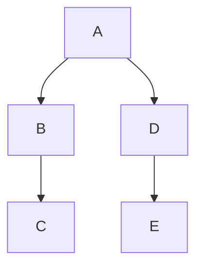

## 為什麼我們需要 Redux？
主要是為了更好的管理 state，如果單純的用 state 和 props 來達成父子溝通，雖然可行，但是專案一大會很混亂，因為各種 state 散亂各處。

又或者是像下面的圖例，假如今天想要把 state 從 E -> C，必須經過 E->D->A->B->C 這樣複雜的傳遞流程。



因為如此，如果有個專門對狀態控管的工具那就再好不過了，所以使用 Redux 的主要目的是「把狀態集中管理，讓狀態管理更容易、清晰。」

## Redux 是什麼？


Redux 官網是這麼說的：
>Redux is a predictable state container for JavaScript apps
>
Redux 是一個讓狀態管理更容易的開發工具，不僅僅限於 React 使用，而是開發 JavaScrip app 都可以使用這套方式。

如同前面所述，如果今天有個 gloabal state 可以使用那就超棒，但當中可能會出現各種問題，比如協作的人改了你用的 state，又或者是改變 state 的字寫錯造成 debug 困難，Redux 當中的各種東西就因應這些狀況而生。

基本流程：```View -> Action -> (Middleware) -> Reducer```

接下來介紹各個角色：

* store：基本上類似於大腦、資料庫的存在，負責存放各種 state。
* reducer：可以當作資料庫的警衛，負責初始化 state，在別人丟過來 action 的時候做檢查判斷。
* dispatch：只要想對 store 內的 state 做更動，就必須丟出 action 來做改動。

## Single Page Application 是什麼？有哪些頁面一定要用這個架構去設計嗎？

使用起來無需換頁，藉由 JavaScript 去動態改變內容的頁面，因為用起來就是一個頁面換來換去，不會把頁面整個刷新，所以叫 Single Page Application。

主要目的就是增進使用者體驗，而什麼網頁是會讓人使用起來覺得很不爽的呢？「持續進行的事情被打斷」，比如正在聽的音樂被打斷、正在播放的影片被中斷，就因為使用者在瀏覽網頁時要換頁的緣故。所以影音平台會比較需要 SPA，比如 youtube、street voice、twitch。

